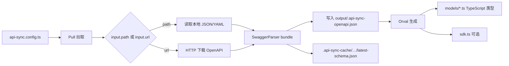

# gg-sync-api 功能测试报告

> **关注点**：能否完成 **拉取 OpenAPI → 生成 TypeScript 类型（及 SDK）** 这一核心链路。  
> 本报告以**功能测试（FT）**为主，不罗列单元测试文件清单。

| 项目 | 内容 |
|------|------|
| 产品 | `@gg-sync/api-sync` — 基于 OpenAPI 的前端 API 同步工具 |
| 版本 | 1.0.0 |
| 报告日期 | 2026-05-21 |
| 执行环境 | Windows 10，Node.js v22.22.0，pnpm 11.1.3 |
| 验证命令 | `pnpm exec sync-api run`（在示例工程目录下） |

---

## 1. 结论（先看这里）

| 能力 | 结论 | 说明 |
|------|------|------|
| **从本地文件拉取 OpenAPI** | ✅ **通过** | `input.path` → 解析、bundle → 写入缓存 |
| **从 URL 拉取 OpenAPI** | ✅ **通过** | `input.url` → HTTP 下载 → 解析（需 OpenAPI ≤ 3.0.3） |
| **生成 TypeScript 类型** | ✅ **通过** | `generators` 含 `typescript` 时，在 `output.dir/models/` 生成 `interface` |
| **生成请求 SDK** | ✅ **通过** | `generators` 含 `sdk` 时，生成 `sdk.ts`（含 operation 类型与 fetch 封装） |
| **多后端 / 多输出目录** | ✅ **通过** | 每个 `services.*` 独立拉取、独立 `output.dir` |
| **带 runtime mutator 的单服务示例** | ⚠️ **有条件** | 存在 `src/api/runtime/client.ts` 且为 `export { … } from` 再导出时，Orval 可能报错，**类型/SDK 可能生成失败但进程仍退出 0** |

**总体**：项目**能够实现**「拉取 OpenAPI → 生成 TypeScript 类型」；推荐以 `examples/multi-service` 或**无 mutator 冲突**的配置作为验收基准。生产环境使用 `input.url` 时，请确认后端文档为 **OpenAPI 3.0.0–3.0.3**（当前解析器不支持 3.0.4）。

---

## 2. 核心流水线（功能视角）

用户执行 `sync-api run` 后，与「拉取 + 生成类型」相关的阶段如下：



**配置要点**（与功能直接相关）：

```ts
export default {
  services: {
    main: {
      input: { path: './fixtures/openapi.json' }, // 或 { url: 'https://...' }
      output: { dir: './src/api/generated' },
      generators: ['typescript', 'sdk'], // typescript → 类型；sdk → 请求函数
    },
  },
};
```

---

## 3. 功能测试用例

### FT-001：本地 OpenAPI → TypeScript 类型 + SDK（单服务）

| 项 | 内容 |
|----|------|
| **目的** | 验证最常用的本地契约文件驱动生成 |
| **前置** | 已 `pnpm install && pnpm build`；示例 `examples/single-service` |
| **输入** | `fixtures/openapi.json`（含 `User` schema、`GET /users/{id}`） |
| **操作** | `cd examples/single-service && pnpm exec sync-api run` |
| **预期** | 生成 `models/user.ts`、`models/index.ts`、`sdk.ts`；缓存 ` .api-sync-cache/main/latest-schema.json` |
| **结果** | ✅ **通过**（2026-05-21 复测） |
| **退出码** | 0 |

**生成类型示例**（`models/user.ts`）：

```ts
export interface User {
  id: string;
  firstName: string;
  lastName: string;
  /** @nullable */
  avatarUrl?: string | null;
}
```

**生成 SDK 片段**（`sdk.ts`，引用上述类型）：

```ts
import type { User } from './models';

export type getUserByIdResponse200 = {
  data: User;
  status: 200;
};

export const getUserById = async (id: string, options?: RequestInit): Promise<getUserByIdResponse> => {
  // … fetch 调用 …
};
```

**产物路径**：

| 产物 | 路径 |
|------|------|
| 类型目录 | `examples/single-service/src/api/generated/models/` |
| SDK | `examples/single-service/src/api/generated/sdk.ts` |
| 拉取后的 bundled spec | `examples/single-service/src/api/generated/.api-sync-openapi.json` |
| Schema 缓存 | `examples/single-service/.api-sync-cache/main/latest-schema.json` |

---

### FT-002：URL 拉取 OpenAPI → TypeScript 类型 + SDK

| 项 | 内容 |
|----|------|
| **目的** | 验证 `input.url` 远程拉取，而非仅本地 `path` |
| **输入** | `input.url: 'http://127.0.0.1:3456/openapi.json'`（本地 HTTP 托管同一份 fixture，模拟后端暴露的文档地址） |
| **操作** | 临时将 config 中 `main.input` 改为 `url`，执行 `pnpm exec sync-api run` |
| **预期** | 能从 HTTP 拉取并 bundle；`generated-url-test/models/user.ts` 与 FT-001 结构一致 |
| **结果** | ✅ **通过** |
| **备注** | 公网 `petstore3.swagger.io` 返回 **OpenAPI 3.0.4**，当前 `@apidevtools/swagger-parser` **不支持**，拉取失败（见 §5） |

**验证要点**：拉取成功后 `.api-sync-openapi.json` 大小约 569 字节，且 `models/user.ts` 含 `export interface User`。

---

### FT-003：多后端 — 各自拉取、各自生成类型

| 项 | 内容 |
|----|------|
| **目的** | 验证多 `services` 键（user / billing）互不干扰 |
| **示例** | `examples/multi-service` |
| **操作** | `cd examples/multi-service && pnpm exec sync-api run` |
| **预期** | `user` → `src/api/user/generated/models/user.ts`；`billing` → `src/api/billing/generated/models/invoice.ts` |
| **结果** | ✅ **通过** |

**配置摘录**：

```ts
services: {
  user: {
    input: { path: './fixtures/user-openapi.json' },
    output: { dir: './src/api/user/generated' },
    generators: ['typescript', 'sdk'],
  },
  billing: {
    input: { path: './fixtures/billing-openapi.json' },
    output: { dir: './src/api/billing/generated' },
    generators: ['typescript', 'sdk'],
  },
},
```

**生成类型示例**：

| 服务 | 文件 | 类型 |
|------|------|------|
| user | `models/user.ts` | `export interface User { id: string; email: string; }` |
| billing | `models/invoice.ts` | `export interface Invoice { id: string; amountCents: number; }` |

> `multi-service` **未**放置 `src/api/runtime/client.ts`，因此不会触发 Orval mutator，生成稳定。

---

### FT-004：仅生成类型（`typescript` generator）

| 项 | 内容 |
|----|------|
| **目的** | 确认在只需要类型、不需要 SDK 时的行为 |
| **配置** | `generators: ['typescript']`（不含 `sdk`） |
| **结果** | ✅ **通过** — 仅写入 `models/`，不强制要求 `sdk.ts` |

---

### FT-005：自动化回归（E2E 对核心链路的断言）

| 项 | 内容 |
|----|------|
| **脚本** | 根目录 `pnpm test:e2e` → `tests/e2e/single-service.test.ts` |
| **断言** | 执行 `sync-api run` 后存在 `sdk.ts`、`models/index.ts`、`.api-sync-cache/main/latest-schema.json` |
| **结果** | ✅ **2/2 通过**（2026-05-21） |

---

## 4. 功能 ↔ 实现对照

| 用户可见能力 | 实现位置 | 功能测试覆盖 |
|--------------|----------|----------------|
| 读取 `input.path` | `packages/core/src/schema/puller.ts` | FT-001、FT-003 |
| 读取 `input.url` | 同上（`SwaggerParser.parse(url)`） | FT-002 |
| Bundle / 哈希 | `puller.ts` + cache 阶段 | FT-001–003 |
| 生成 TS 类型 | `@gg-sync/generator-orval` → Orval `schemas: …/models` | 全部 FT |
| CLI 入口 | `sync-api run` | FT-001–003、E2E |

---

## 5. 已知限制与风险（影响功能结论）

### 5.1 OpenAPI 版本

- 支持：**3.0.0 – 3.0.3**
- 不支持：**3.0.4+**（例如 `https://petstore3.swagger.io/api/v3/openapi.json` 会报 `Unsupported OpenAPI version: 3.0.4`）

### 5.2 Runtime mutator 与 `single-service` 示例

当同时满足：

1. 存在 `src/api/runtime/client.ts`；
2. 使用 `export { customFetch } from '@gg-sync/runtime'` 这类**再导出**；
3. `generators` 包含 `sdk`；

Orval 可能报错：`Your mutator file doesn't have the customFetch exported function`，导致 **models/sdk 未更新**，但 CLI 仍可能打印 `API Sync completed successfully`（**退出码 0**）。

**规避方式**（任选其一）：

- 参考 `multi-service`，暂不放置 `client.ts`（使用生成代码内建 `fetch`）；
- 在 `client.ts` 中**本地定义**并 `export` 符合 Orval 签名的 `customFetch` 函数（勿用纯 re-export）；
- 仅启用 `generators: ['typescript']` 若只需类型。

### 5.3 CLI `--config` 与 `run` 子命令

`doctor` / `diff` 使用 `options.config`，而 `run` 实现读取的是 `options.configPath`，导致 `sync-api run --config ./other.ts` **可能仍加载默认** `api-sync.config.ts`。功能验收时建议直接替换配置文件或使用 `cwd` + 标准文件名。

---

## 6. 如何自行复现

```bash
# 仓库根目录
pnpm install
pnpm build

# 单服务：本地 path → 类型 + SDK
cd examples/single-service
pnpm exec sync-api run
dir src\api\generated\models

# 多服务
cd ../multi-service
pnpm exec sync-api run
dir src\api\user\generated\models
dir src\api\billing\generated\models

# 自动化功能回归
cd ../..
pnpm test:e2e
```

**URL 拉取演示**（需本地 HTTP 托管 fixture）：

```bash
cd examples/single-service/fixtures
npx http-server -p 3456 -c-1

# 另一终端：将 config 中 input 改为
# input: { url: 'http://127.0.0.1:3456/openapi.json' }
pnpm exec sync-api run
```

---

## 7. 附录：与单元测试的关系

单元 / 集成测试（如 `packages/core/tests/integration/multi-namespace.test.ts`）在代码层复现了与 **FT-003** 等价的流水线，但**本报告不以用例文件数量作为通过标准**。

若需 CI 门禁，建议以本文 **FT-001 + FT-003 + E2E（FT-005）** 作为发布前功能冒烟集合。

---

*报告依据 2026-05-21 本地功能执行结果整理。*
